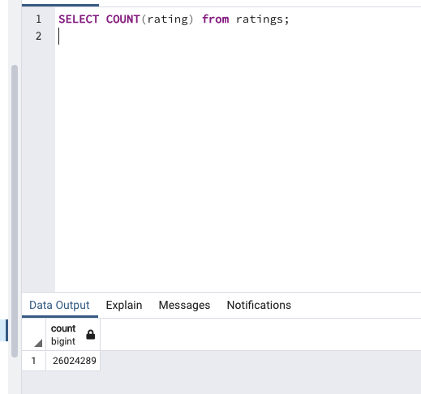

# Movies-ETL

## Description

In this module we are performing an Extract, Transform, Load (ETL) process to create data pipelines using Python, Pandas and PostgreSQL using very large data files.

## Process

- Extract: In the Extract phase, data is pulled from external or internal sources, possibly disparate. The sources could be flat files, scraped webpages in HTML or JavaScript Object Notation (JSON) format, SQL tables, or even streams of sensor data. The extracted data is held in a staging area in between the data sources and data targets.
  In this module we extracted scraped Wikipedia data stored as a JSON, and Kaggle data stored in CSVs.

- Transform: The transformation phase can be accomplished with Python and Pandas, pure SQL, or specialized ETL tools like Apache Airflow or Microsoft SQL Server Integrated Services (SSIS). We used Python and Pandas to explore, document, and perform our data transformation.

- Load: Finally, after the data is transformed into a consistent structure, it's loaded into the data target. The data target can be a relational database like PostgreSQL, a non-relational database like MongoDB that stores individual documents, or a data warehouse like Amazon Redshift that optimizes performance specifically for analytics.

## Results

We were able to clean, merge the datasets and export the two new tables into PostgreSQL by using Python. The final results created a movies table with 6,052 rows. A 17% reduction from the original of 7,311 and a ratings table with 26,024,289 rows.

